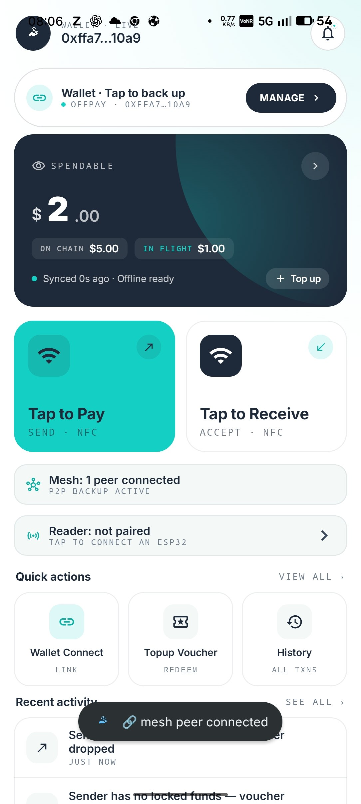
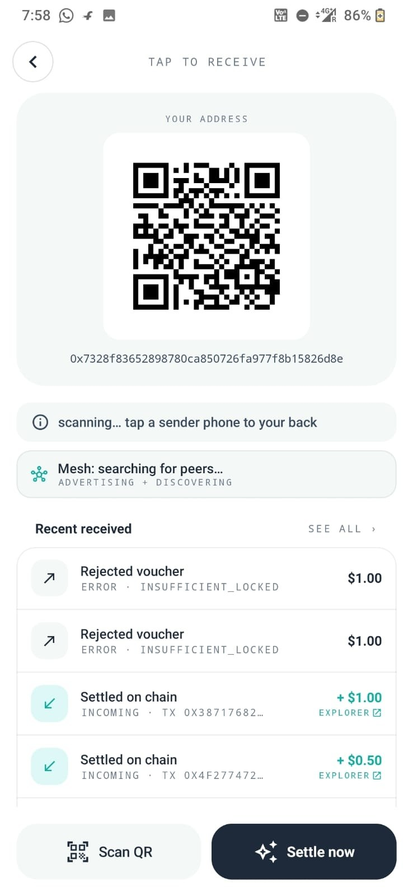
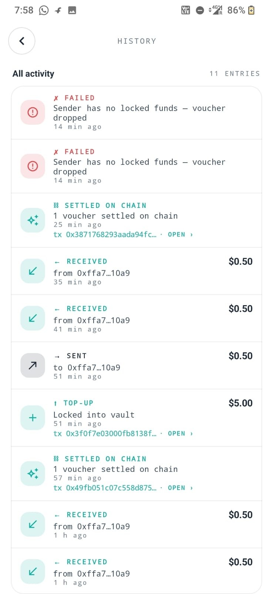

<div align="center">


# OFFPAY

**Tap. Settle later. Even when nobody has internet.**

**SUBMISSION LINK-> https://devfolio.co/projects/offpay-03c3 **

MockUSDC payments where the customer is offline, the merchant is offline,
and the chain isn't even nearby — yet the money still moves
deterministically when *anyone* in the room has bandwidth.

Polygon Amoy testnet · Solidity contracts · Android (Jetpack Compose) · ESP32 + RC522 firmware

</div>

---

## Demo

<video src="https://github.com/SCARPxVeNOM/offline-pay/raw/main/docs/img/offpay-demo.mp4" controls width="100%"></video>

---

## Screenshots

<div align="center">
<table>
<tr>
<td align="center"><strong>Home Screen</strong></td>
<td align="center"><strong>QR & Transactions</strong></td>
<td align="center"><strong>Activity History</strong></td>
</tr>
<tr>
<td></td>
<td></td>
<td></td>
</tr>
</table>
</div>

---

## The problem we're solving

In the streets we live in — chai stalls, ration shops, auto rickshaws —
the moment of payment is the moment your bandwidth is worst. The vendor
is in a basement food court, the customer's data plan is throttled, both
phones briefly drop to zero bars while the QR scanner spins. Today this
means waiting, retrying, embarrassment. UPI **owns the rails when the
rails are up**, but it has no graceful answer for the seconds when they
aren't.

**The hard cases that break every existing solution:**

| Scenario | What today's apps do | What people actually need |
|---|---|---|
| Customer's phone in airplane mode | Refuses transaction | Pay anyway; settle whenever the customer reconnects |
| Vendor's phone offline AND customer's phone offline | Total failure | The transaction still finalises — somehow |
| Customer doesn't have a smartphone | Excluded from digital payments | Carry a contactless card; a card-reader handles them |
| Vendor's hardware fails mid-day | Lost sales until repair | Any phone in the shop becomes the till in 30 seconds |
| The relay node tries to steal the payment | — | Cryptographic proof binds the payee at tap time |

OFFPAY exists for those exact moments. The customer can be offline. The
merchant can be offline. The relay (literally any other phone in the
mesh) does the on-chain work the moment it has signal — and the protocol
is constructed so the relay **physically cannot redirect** the funds.

---

## What we discovered

Three insights, layered:

### 1. The voucher is a signed promise, not a payment

A voucher is `(payer, recipient, amount, expiry, nonce, voucherId)` signed
by the customer. **The chain does the bookkeeping; the voucher is just a
verifiable IOU.** Both phones verify the signature locally with no chain
contact at all. Replay is gated by a `voucherId` set on the contract, so a
duplicate or relayed voucher reverts harmlessly.

### 2. The recipient is part of the signed digest

In v3 of `OfflineVault`, the customer's signature commits to the
recipient's address. A relay node — any third phone with internet —
broadcasts `settleBearerBatch(...)` and pays the gas. Because the recipient
is bound at signing time, the relay literally cannot redirect funds to
itself. The vault checks the signature, decrements `lockedBalance[payer]`,
transfers MockUSDC to `voucher.recipient`. Done.

### 3. For physical bearer cards, the merchant binds at tap time

This is the part that breaks every other "offline blockchain" attempt. A
MIFARE card holds a customer's signed voucher with `recipient = 0x0` —
nobody is named yet. When the customer taps it on a vendor's ESP32 reader,
the **reader signs a fresh endorsement**:
`(voucherId, device, merchantPrimary, timestamp)`. The endorsement
commits to the vendor's actual wallet, then `settleBearerWithEndorsement`
verifies *both* signatures on chain and pays the vendor — not the relay,
not msg.sender, not whoever found the card on the floor. **The vendor's
ESP32 is the unforgeable binding authority.**

---

## System architecture

```
                          POLYGON AMOY
                         ┌────────────┐
                         │ OfflineVault│  ← settles vouchers, holds funds
                         │ + MockUSDC │
                         │ + Registry │
                         └─────▲──────┘
                               │ tx (gas paid by relay)
                               │
        ┌──────────────────────┼──────────────────────┐
        │                      │                      │
   ┌────┴────┐            ┌────┴────┐            ┌────┴────┐
   │ Phone A │── BLE/WiFi─│ Phone B │── BLE/WiFi─│ Phone C │
   │CUSTOMER │   mesh     │MERCHANT │   mesh     │ RELAY   │
   │ offline │            │ offline │            │ online  │
   └────┬────┘            └────▲────┘            └─────────┘
        │                      │
        │ NFC tap              │ BT SPP
        │ (HCE voucher)        │
        │                      │
        │                 ┌────┴────┐
        │                 │  ESP32  │  ← merchant's "card terminal"
        │                 │ + RC522 │     reads MIFARE cards
        └─── MIFARE ─────►│  reader │     signs endorsements
              card        └─────────┘     bonded to phone B
```

**Three layers, each replaceable:**

1. **Phone-to-phone NFC tap** — instant peer payments without any extra
   hardware. Works between any two phones running the OFFPAY app.
2. **Phone-to-mesh-to-relay** — when both customer and merchant are
   offline, any third phone within Bluetooth/Wi-Fi-Direct range and
   carrying internet broadcasts the settle on their behalf. Built on
   Google Nearby Connections (`P2P_CLUSTER`) with a deterministic
   tie-break to avoid simultaneous-connect deadlocks.
3. **ESP32 merchant box** — a $5 reader that turns a MIFARE card into a
   spending instrument. The customer's phone never has to be at the stall
   — the card is the instrument, the reader is the binding authority.

---

## The ESP32 merchant box

The reader is a **stateless trust anchor** for the merchant. It's not a
backend, it's not a server — it's a notary that stamps every card-tap
with the merchant's wallet address.

```
 ┌──────────────────────────────────────────────────────────┐
 │                       ESP32 BOX                          │
 │                                                          │
 │  ┌────────┐   ┌────────────┐   ┌─────────────────┐       │
 │  │ RC522  │──►│  Sketch    │──►│ secp256k1 key   │       │
 │  │  RFID  │   │ loop()     │   │ + Keccak-256    │       │
 │  └────────┘   │ pumpBT()   │   │ in NVS          │       │
 │               │ onClaim()  │   └─────────────────┘       │
 │  ┌────────┐   │ onAuth()   │                             │
 │  │ Buzzer │◄──│ onWriteData│   ┌─────────────────┐       │
 │  │ + LEDs │   │            │──►│ BluetoothSerial │       │
 │  └────────┘   └────────────┘   │  SPP to phone   │       │
 │                                └─────────────────┘       │
 └──────────────────────────────────────────────────────────┘
```

**Three command surfaces over BT SPP:**

| Command | Purpose | Auth |
|---|---|---|
| `CLAIM` | A phone takes ownership of this reader | Phone signs a fresh nonce; firmware verifies + persists `owner` to NVS |
| `AUTH` + `WRITE_DATA` | Owner asks reader to write a voucher onto the next-tapped card | Two-line protocol (split for the ESP-IDF 512-byte SPP RX limit); EIP-191 signature over `OFFPAY-WRITE-V1 \|\| esp_mac \|\| nonce \|\| keccak256(json)` |
| Card tap | Read existing voucher → emit `VOUCHER` + `ENDORSE` over BT to bonded phone | Reader's own secp256k1 key signs `(voucherId, device, owner, ts, chainId, vault)` |

**Mode-aware loop**: the firmware boots in `IDLE`, switches to `READ` only
when the phone explicitly asks (`MODE READ` over BT — sent by the merchant
phone when it opens the Receive screen). Without this, the read loop
hammers the RC522's SPI bus and starves Bluetooth, dropping inbound
WRITE bytes.

**Sentinel-based replay protection**: after a successful settle, the
firmware overwrites all 21 voucher data blocks with `USED____________`
so the same physical card can't double-spend even before the on-chain
nullifier propagates.

**Ownership is transferable**: any phone with this app can re-pair the
reader by sending a fresh `CLAIM`. The latest valid signature wins. So a
single ESP32 can be passed between customers and stalls in a market
without any provisioning step beyond opening the app.

---

## Full user flow — three phones, one card, zero internet at the stall

This is the hardest scenario we proved end-to-end:

> **Setup**: Customer (Nothing phone) tops up $5 at home over Wi-Fi.
> Vendor (OnePlus) is at the stall with an ESP32 reader. A bystander
> (Samsung) walks past with regular LTE.

```
1. AT HOME (online, customer)
─────────────────────────────
    Nothing phone:  signNextBearerForCard(amount=$1)
                    → voucher with recipient = 0x0
                    → BluetoothSerial → ESP32 → MIFARE write
    MIFARE card now holds: {payer=Nothing, recipient=0, sig=...}

2. AT THE STALL (offline, customer + merchant)
──────────────────────────────────────────────
    Customer hands card to merchant.
    OnePlus is bonded to ESP32 (claimed earlier).
    OnePlus opens Receive screen → BT MODE READ → reader wakes.
    Customer taps card on ESP32:

      ESP32 reads voucher from blocks 4-30
      ESP32 signs ENDORSE over (voucherId, esp_addr,
                                onePlus_primary_wallet, ts)
      ESP32 → BT → OnePlus:
          VOUCHER 0x9d76… 271e1d25 {"i":...,"p":...}
          ENDORSE 12345 0xc6cf…(OnePlus) 0x9d76…(ESP) 0xa1b2…
      OnePlus stores voucher row + endorsement bundle
      OnePlus → BT → ESP32: ACCEPT
      ESP32 writes USED____________ across the card
      OnePlus gossips voucher+endorsement on the mesh

3. RELAY SETTLE (Samsung walks into BT range, has internet)
───────────────────────────────────────────────────────────
    Samsung receives mesh replica:
      {voucher with recipient=0x0,
       endorsement(voucherId, esp_addr, OnePlus_primary, ts, sig)}
    Samsung's autoSettle picks it up → recipient=0 + endorsement set
      → calls settleBearerWithEndorsement(...)
    Contract verifies BOTH signatures on chain:
      - voucher sig recovers to Nothing (the payer)
      - endorsement sig recovers to ESP32's wallet
      - merchantPrimary committed inside endorsement = OnePlus
    MockUSDC transferred: vault → OnePlus
    Samsung emits "settled" over the mesh.

4. EVERYONE'S BALANCE UPDATES
─────────────────────────────
    Nothing (customer):   lockedBalance ↓ $1
    OnePlus (merchant):   usdc.balanceOf ↑ $1
    Samsung (relay):      paid the gas, no other change
```

**No phone in this flow needed both BT and internet at the same moment**.
The customer was online once, at home. The merchant never had internet.
The relay had internet but never touched a card. **The chain saw two
signatures and paid the right wallet.**

---

## Real-time balances across devices

OFFPAY isn't a static balance display — every phone in the mesh updates
within seconds of any chain event:

- **1-second render tick** recomputes spendable from the local cache
  (locked − in-flight) so the UI feels responsive at signing time.
- **8-second chain poll** when online pulls fresh `lockedBalance` and
  `usdc.balanceOf` so the on-chain figure stays honest. Receivers'
  wallet balance updates automatically; senders' locked balance ticks
  down when their vouchers settle.
- **Mesh `settled` event**: when any peer settles a voucher on chain,
  it gossips the tx hash. Every other phone in range immediately marks
  the voucher settled in its `BalanceCache`, drops in-flight, and ticks
  the spendable up. **No chain RPC required on the receiver's side.**
- **`NetworkCallback.onAvailable`** triggers an immediate refresh the
  moment Wi-Fi reconnects.

The receiver who got paid offline sees `ON CHAIN` climb the second the
mesh delivers the settled tx. The customer who paid offline sees
`SPENDABLE` drop the instant they sign. The relay sees nothing change —
they just paid the gas.

---

## On-chain proof

**Live deployment on Polygon Amoy**

| Contract | Address |
|---|---|
| **OfflineVault** (v3.1 — bearer + endorsement) | [`0x3E73aa7506c5a833E0842c948458af9d63C19dCd`](https://amoy.polygonscan.com/address/0x3E73aa7506c5a833E0842c948458af9d63C19dCd) |
| OfflineVault (v3 — recipient-bound bearer) | [`0x2D8218329389545Cb12b37e2ED961BDB97d3661f`](https://amoy.polygonscan.com/address/0x2D8218329389545Cb12b37e2ED961BDB97d3661f) |
| MerchantRegistry | [`0xc1Ac9cAF9D7aE09dF1a1d587587fF1Ae6420Cc1a`](https://amoy.polygonscan.com/address/0xc1Ac9cAF9D7aE09dF1a1d587587fF1Ae6420Cc1a) |
| MockUSDC (test stable) | [`0x17ffe8373658Fb333530e4446becb19dB6239e1e`](https://amoy.polygonscan.com/address/0x17ffe8373658Fb333530e4446becb19dB6239e1e) |
| Backend gas signer | [`0x092661531D9186Fa6E48501A5e3b508B3F52e64c`](https://amoy.polygonscan.com/address/0x092661531D9186Fa6E48501A5e3b508B3F52e64c) |

**Settled transactions — pulled live from `VoucherSettled(...)` event logs**

These are real on-chain settlements from the v3.1 vault. Each one is a
voucher that started as bytes on a MIFARE card or an NFC tap and ended as
a MockUSDC transfer to the recipient's wallet:

- [`0x00dc3a8120080b42eec8ad3e65650011c56ebd5de7bedcae8864bf99a7b67a3c`](https://amoy.polygonscan.com/tx/0x00dc3a8120080b42eec8ad3e65650011c56ebd5de7bedcae8864bf99a7b67a3c)
- [`0x49fb051c07c558d87562b261a21812de3d3c5b6cbdef475c89e82ec83d127ea1`](https://amoy.polygonscan.com/tx/0x49fb051c07c558d87562b261a21812de3d3c5b6cbdef475c89e82ec83d127ea1)
- [`0xa23e0724a317627975bebc0a0b6cd577ff85e6c0fba99b9488cdc8d1dd0aa87c`](https://amoy.polygonscan.com/tx/0xa23e0724a317627975bebc0a0b6cd577ff85e6c0fba99b9488cdc8d1dd0aa87c)
- [`0xd17685dfa016f4a7f0597640918a93f0f9961bd728476ce030c28d2de911165a`](https://amoy.polygonscan.com/tx/0xd17685dfa016f4a7f0597640918a93f0f9961bd728476ce030c28d2de911165a)
- [`0x4f277472b49131e067549b6925ff4f59f915c28ec545b005012524cf98ec2d1e`](https://amoy.polygonscan.com/tx/0x4f277472b49131e067549b6925ff4f59f915c28ec545b005012524cf98ec2d1e)
- [`0x3871768293aada94fc1f1e01d619cae5a29b75f7c3532c091288ea79b3c4312c`](https://amoy.polygonscan.com/tx/0x3871768293aada94fc1f1e01d619cae5a29b75f7c3532c091288ea79b3c4312c)

**Earlier v3 vault settlements** (recipient-bound bearer flow, before the
bearer-card layer):

- [`0xe8e90a2200396f00a9133fe5fd67463ae78efa77724b25ea9f0273011337012d`](https://amoy.polygonscan.com/tx/0xe8e90a2200396f00a9133fe5fd67463ae78efa77724b25ea9f0273011337012d)
- [`0x29a4d2a235e55dc5cfe9221276fb18502355a3eb0e629beb3f5a34e5efa93ff0`](https://amoy.polygonscan.com/tx/0x29a4d2a235e55dc5cfe9221276fb18502355a3eb0e629beb3f5a34e5efa93ff0)
- [`0x696f1f9372f8e317dbfb03d1bac4d44f6844d7ff4a70aee5eefd0b64bce183b9`](https://amoy.polygonscan.com/tx/0x696f1f9372f8e317dbfb03d1bac4d44f6844d7ff4a70aee5eefd0b64bce183b9)

Across both vaults, **39+ on-chain settlements** logged from real
phone-to-phone and card-based test flows during development.

---

## Contract design highlights

### `OfflineVault.settleBearerWithEndorsement`

The new function added in v3.1, the cornerstone of true-bearer cards:

```solidity
function settleBearerWithEndorsement(
    Voucher calldata v,
    bytes calldata voucherSig,
    address device,             // ESP32 wallet that endorsed
    address merchantPrimary,    // who actually gets paid
    uint256 endorsementTs,
    bytes calldata deviceSig
) external whenNotPaused nonReentrant {
    require(v.merchant  == address(0), "not bearer");
    require(v.recipient == address(0), "must be true bearer");
    require(merchantPrimary != address(0), "primary=0");
    require(!usedVouchers[v.voucherId], "already settled");
    require(block.timestamp <= v.expiry, "expired");
    require(v.amount > 0 && v.amount <= maxSinglePayment, "bad amount");
    require(lockedBalance[v.payer] >= v.amount, "insufficient locked");

    bytes32 vDigest = voucherDigest(v);
    require(vDigest.toEthSignedMessageHash().recover(voucherSig) == v.payer,
            "bad voucher sig");

    bytes32 eDigest = endorsementDigest(v.voucherId, device,
                                        merchantPrimary, endorsementTs);
    require(eDigest.toEthSignedMessageHash().recover(deviceSig) == device,
            "bad endorsement sig");

    usedVouchers[v.voucherId] = true;
    lockedBalance[v.payer]   -= v.amount;
    require(usdc.transfer(merchantPrimary, v.amount), "payout failed");
    emit VoucherSettled(v.voucherId, v.payer, merchantPrimary,
                        v.amount, v.nonce);
}
```

**Two signatures, one transaction.** A relay broadcasting this can:

- ✗ NOT redirect to themselves — `merchantPrimary` is committed inside
  `deviceSig`. Tampering with it invalidates the signature.
- ✗ NOT replay an old endorsement — the voucher's `usedVouchers` flag
  flips after the first successful settle.
- ✗ NOT forge an endorsement — they don't have the ESP32's private key.
- ✗ NOT pay themselves the gas back — there's no msg.sender refund logic.

The relay gets nothing for their effort except participating in the
mesh. Which is exactly the role we wanted.

### Endorsement digest (mirrored byte-for-byte across all three platforms)

```
keccak256(abi.encode(
    keccak256("OFFPAY-ENDORSE-V1"),
    voucherId,           // bytes32
    device,              // address
    merchantPrimary,     // address
    endorsementTs,       // uint256
    block.chainid,       // uint256
    address(this)        // address
))
```

This same byte layout is reproduced:

- **Solidity** in `OfflineVault.endorsementDigest()`
- **C++** in `firmware/reader/offline_pay_reader.ino:emitEndorsement()`
  using a hand-rolled Keccak-256 (not `mbedtls_sha3` — different padding!)
- **Kotlin** in `EndorsementDigest.kt` using Web3j's `Hash.sha3` and
  `TypeEncoder.encode`

Test coverage in `contracts/test/OfflineVault.test.js` includes 30
passing cases including: forged endorsement rejection, primary tampering
rejection, double-spend across both bearer paths, and the happy-path
end-to-end.

---

## Repo layout

```
contracts/        Hardhat workspace — OfflineVault, MerchantRegistry, MockUSDC, tests, deploy scripts
backend/          Node 18+ Express. Gas-sponsors first-time wallets, exposes /rpc proxy + /api/wallet/init.
android-wallet/   Kotlin Compose wallet — both customer and merchant in one app.
firmware/reader/  ESP32 sketch + secp256k1 device wallet (NVS-persisted).
docs/             Pitch, threat model, demo runbook, design assets.
```

**Critical files to read in order:**

1. `contracts/contracts/OfflineVault.sol` — the rules of the system
2. `firmware/reader/offline_pay_reader.ino` — the merchant box state machine
3. `android-wallet/.../MeshBroadcaster.kt` — Nearby Connections layer with retry queue, address tie-break, settled-event gossip
4. `android-wallet/.../EspWriteClient.kt` — the two-step phone↔reader auth protocol
5. `android-wallet/.../HomeActivity.kt` — real-time balance loop + autoSettle dispatcher
